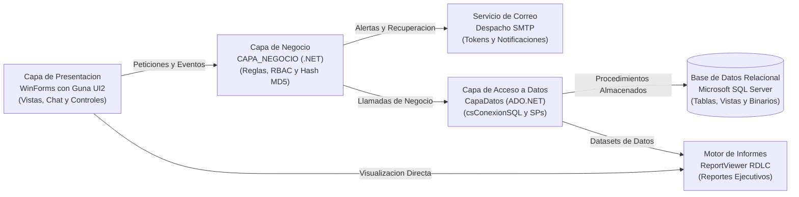

# Sistema de Gestion de Bolsa de Empleo, Reclutamiento y Red Profesional (V21)

Plataforma de escritorio empresarial disenada para la administracion integral de talento humano, intermediacion laboral, auditoria documental y networking profesional. La solucion implementa una arquitectura N-Capas sobre tecnologias Microsoft .NET y Microsoft SQL Server, ofreciendo una interfaz de usuario moderna enriquecida con Guna UI2 y un motor analitico de reportes ejecutivos con Microsoft Reporting Services (RDLC).

---

## Tabla de Contenidos
1. [Descripcion General](#descripcion-general)
2. [Arquitectura de Software](#arquitectura-de-software)
3. [Modulos del Sistema](#modulos-del-sistema)
4. [Catalogo de Reportes RDLC](#catalogo-de-reportes-rdlc)
5. [Stack Tecnologico](#stack-tecnologico)
6. [Estructura de la Solucion](#estructura-de-la-solucion)
7. [Requisitos y Puesta en Marcha](#requisitos-y-puesta-en-marcha)
8. [Seguridad y Estandares Tecnicos](#seguridad-y-estandares-tecnicos)
9. [Creditos y Licencia](#creditos-y-licencia)

---

## Descripcion General

El sistema centraliza y optimiza los flujos de seleccion y vinculacion laboral entre organizaciones contratantes y postulantes profesionales. Proporciona herramientas avanzadas para la verificacion de credenciales academicas y laborales, reduciendo el riesgo de perfiles fraudulentos mediante un panel de control y auditoria documental.

### Objetivos Clave
* **Intermediacion Eficiente:** Conectar a postulantes calificados con ofertas de trabajo segmentadas por rango salarial, experiencia requerida, ubicacion geografica y modalidad de trabajo.
* **Acreditacion y Rigor Documental:** Proceso de revision formal en el que administradores y reclutadores validan titulos universitarios, certificados laborales y documentos de constitucion empresarial (RUC).
* **Comunicacion Directa:** Canal de mensajeria interna y networking profesional para agilizar etapas de entrevistas y coordinacion.
* **Inteligencia Operativa:** Generacion de informes consolidados para la toma de decisiones basada en metricas de empleabilidad y demanda laboral.

---

## Arquitectura de Software

La aplicacion se fundamenta en un patron arquitectonico N-Capas (N-Tier Architecture), asegurando una estricta separacion de responsabilidades, alta mantenibilidad y desacoplamiento entre la interfaz grafica, las reglas de negocio y el acceso a datos.



---

## Modulos del Sistema

### 1. Modulo de Autenticacion y Control de Acceso (RBAC)
* **Control Basado en Roles:** Segmentacion de privilegios para perfiles de Administrador, Empresa / Reclutador y Profesional / Postulante.
* **Cifrado de Credenciales:** Hashing criptografico MD5 con salting dinamico basado en el identificador de usuario para mitigar ataques de diccionario y tablas rainbow.
* **Recuperacion de Credenciales:** Generacion de tokens numericos temporales despachados automaticamente mediante el protocolo SMTP a la bandeja de correo del usuario.

### 2. Modulo de Gestion de Perfil Profesional
* **Hoja de Vida Estructurada:** Registro de informacion personal, datos de contacto y presentacion profesional.
* **Formacion Academica:** Registro de titulos, instituciones educativas, niveles de instruccion y fechas de titulacion con adjuntos probatorios.
* **Experiencia Laboral:** Historial de cargos previos, organizaciones, tiempo de servicio y funciones desempenadas.
* **Acreditacion de Idiomas:** Registro de competencias linguisticas y niveles de suficiencia.
* **Carga de Archivos Binarios:** Almacenamiento seguro de curriculums vitae y certificados en la base de datos como objetos binarios (`VARBINARY`).

### 3. Modulo de Auditoria y Validacion Documental
* **Validacion Corporativa:** Verificacion de documentos legales de las empresas registradas (RUC, razon social y permisos).
* **Auditoria de Postulantes:** Bandeja de revision para validar la veracidad de titulos y certificaciones subidas por los candidatos.
* **Registro de Observaciones:** Trazabilidad de motivos de aprobacion o rechazo con retroalimentacion inmediata al usuario.

### 4. Modulo de Ofertas Laborales y Postulaciones
* **Publicacion de Vacantes:** Formulario para creacion de ofertas con definicion de rangos salariales (minimo/maximo), experiencia requerida, provincia, ciudad, modalidad (presencial, remota, hibrida) y tipo de jornada.
* **Flujo de Postulacion:** Vinculacion directa del perfil profesional y curriculum vitae a la vacante.
* **Embudo de Seleccion:** Herramienta para reclutadores que permite visualizar la lista de postulantes, descargar su CV en formato original y actualizar su estatus (En Revision, Preseleccionado, Aprobado o Rechazado).

### 5. Modulo de Networking y Mensajeria Interna
* **Directorio de Conexiones:** Sistema de administracion de contactos profesionales.
* **Mensajeria en Tiempo Real:** Chat bidireccional entre candidatos y empresas para coordinar entrevistas tecnicas y aclaraciones del perfil.

---

## Catalogo de Reportes RDLC

El sistema integra el motor Microsoft Reporting Services con definiciones de reporte de cliente (RDLC) para la emision de documentos ejecutivos:

| Archivo de Reporte | Descripcion Operacional | Parametros y Dataset |
| :--- | :--- | :--- |
| `rptUsuario2.rdlc` | Directorio y estado de cuentas de usuarios del sistema | Dataset: `dsUsuario` |
| `rptPublicaciones2.rdlc` | Consolidado general de ofertas laborales publicadas | Dataset: `dsPublicaciones` |
| `RptVisualizarPublicacionesFecha.rdlc` | Reporte cronologico filtrado por rango de fechas y estado | Procedimiento: `PReporteNumeroEmpleosPublicados` |
| `rptPostulaciones2.rdlc` | Registro historico de postulaciones por vacante y candidato | Dataset: `dsPostulaciones2` |
| `rptEmpresas2.rdlc` | Padron corporativo de empresas registradas y auditadas | Dataset: `dsEmpresa2` |
| `rptProfesionales2.rdlc` | Catalogo de profesionales activos y perfiles disponibles | Dataset: `dsProfesionales2` |
| `rptDocAcademico2.rdlc` | Trazabilidad de documentos academicos validados y pendientes | Dataset: `dsDocAcademico` |
| `rptExpLaboral2.rdlc` | Detalle consolidado de la trayectoria laboral de postulantes | Dataset: `dsExpLaboral` |

---

## Stack Tecnologico

### Plataforma y Lenguaje
* **Lenguaje:** C# (C-Sharp)
* **Framework:** Microsoft .NET Framework 4.7.2
* **Paradigma:** Programacion Orientada a Objetos (POO), Arquitectura N-Capas, Event-Driven Programming

### Interfaz de Usuario y Componentes Visuales
* **Framework UI:** Windows Forms (WinForms)
* **Suite de Componentes:** Guna.UI2.WinForms version 2.0.4.7 (Controles modernos, diseno plano y animaciones fluidas)
* **Visualizador de Informes:** Microsoft Reporting Services ReportViewerControl Winforms version 150.1652.0
* **Soporte Espacial:** Microsoft.SqlServer.Types version 160.1000.6

### Persistencia y Motor de Base de Datos
* **Gestor de Base de Datos:** Microsoft SQL Server 2017 / 2019 / 2022 o SQL Server Express
* **Acceso a Datos:** ADO.NET nativo (`System.Data.SqlClient`)
* **Logica en Servidor:** Procedimientos Almacenados (Stored Procedures), Vistas y Transacciones ACID

### Servicios de Red y Protocolos
* **Mensajeria Transaccional:** `System.Net.Mail` con soporte de cifrado SSL/TLS para despachos SMTP

---

## Estructura de la Solucion

```
V21/
├── APP_NET.sln                         # Archivo de solucion de Visual Studio
├── Presentacion/                       # Capa de Presentacion (Windows Forms)
│   ├── CAPA_PRESENTACION.csproj        # Proyecto principal de interfaz de usuario
│   ├── Program.cs                      # Punto de entrada de la aplicacion (frmLOGEAGOR)
│   ├── App.config                      # Configuracion de entorno .NET
│   ├── FRMNUEVOS/                      # Formularios modernos (Login, Registro, Validaciones)
│   ├── Formularios/                    # Formularios de gestion de perfil, ofertas y menu
│   ├── Mensajeria/                     # Interfaz de chat y networking
│   ├── Parte Adminitardor/             # Panel de auditoria y aprobacion de ofertas
│   ├── Controls/                       # Controles de usuario personalizados
│   ├── Clases/                         # Clases auxiliares de formateo visual
│   ├── Resources/                      # Recursos graficos e iconos institucionales
│   └── rpt*.rdlc                       # Plantillas de informes RDLC de Microsoft ReportViewer
├── Logica/                             # Capa de Logica de Negocio
│   ├── CAPA_NEGOCIO.csproj             # Proyecto de logica de negocio
│   ├── csLogin.cs                      # Control de autenticacion y verificacion de roles
│   ├── csUsers.cs                      # Logica de postulantes y usuarios
│   ├── csEmpresa.cs                    # Reglas de negocio para organizaciones
│   ├── Publicaciones.cs                # Gestion de ofertas laborales y estado de documentos
│   ├── csCorreoElectronico.cs          # Cliente SMTP transaccional
│   ├── csMensajesDCorreosYMensajitos.cs # Validadores de entrada y gestor de dialogos
│   ├── csReportes.cs                   # Orquestador de datasets para informes
│   └── New_Clases/                     # Controladores y adaptadores especializados
├── Datos/                              # Capa de Acceso a Datos (ADO.NET)
│   ├── CapaDatos.csproj                # Proyecto de acceso a base de datos
│   ├── csConexionSQL.cs                # Administrador de conexion y ejecucion SQL
│   ├── csUsuariosBD.cs                 # Persistencia de usuarios y credenciales
│   ├── csEmpresaBD.cs                  # Persistencia de entidades corporativas
│   ├── csPublicacionBD.cs              # Persistencia de vacantes y postulaciones
│   ├── CsDtValidacionDocs.cs           # Consultas para auditoria documental
│   ├── CsDatosPerfilProfesional.cs     # Consultas de expedientes profesionales
│   └── csReportesBD.cs                 # Ejecucion de procedimientos de reportes
└── README.md                           # Documentacion tecnica empresarial
```

---

## Requisitos y Puesta en Marcha

### Requisitos Previos del Sistema
1. **Sistema Operativo:** Windows 10 / Windows 11 (64 bits).
2. **Entorno de Desarrollo:** Visual Studio 2019, 2022 o Visual Studio Enterprise con la carga de trabajo de *Desarrollo de escritorio de .NET*.
3. **Plataforma:** .NET Framework 4.7.2 Developer Pack o superior.
4. **Motor de Base de Datos:** Instancia local o remota de Microsoft SQL Server con soporte para autenticacion SQL o autenticacion integrada de Windows.

---

### Procedimiento de Instalacion y Configuracion

#### 1. Clonacion del Repositorio
```bash
git clone https://github.com/JeremyJaramillo72/Sistema-de-Gestion-de-Bolsa-de-Empleo-Escritorio.git
cd Sistema-de-Gestion-de-Bolsa-de-Empleo-Escritorio
```

#### 2. Configuracion de la Cadena de Conexion a Base de Datos
Abrir el archivo `Datos/csConexionSQL.cs` y configurar la cadena de conexion correspondiente al servidor SQL Server:

```csharp
public string cadenaConexion = @"Server=NOMBRE_DE_TU_SERVIDOR\SQLEXPRESS;Database=APLICACION_NETWORKING;User Id=TU_USUARIO;Password=TU_CONTRASENA;";
```

O si se utiliza autenticacion de Windows:

```csharp
public string cadenaConexion = @"Server=localhost\SQLEXPRESS;Database=APLICACION_NETWORKING;Integrated Security=True;";
```

#### 3. Restauracion de Paquetes NuGet
Desde la consola del Administrador de Paquetes de Visual Studio o mediante linea de comandos:

```bash
nuget restore APP_NET.sln
```

#### 4. Compilacion y Ejecucion
1. Abrir la solucion `APP_NET.sln` en Visual Studio.
2. Establecer el proyecto `Presentacion` como proyecto de inicio (*Set as Startup Project*).
3. Seleccionar la configuracion `Debug` o `Release` con plataforma `Any CPU`.
4. Compilar la solucion (`Ctrl + Shift + B`) y ejecutar con depuracion (`F5`).

---

## Seguridad y Estandares Tecnicos

* **Proteccion contra Inyeccion SQL:** Todas las consultas hacia SQL Server se canalizan mediante `SqlCommand` con parametros fuertemente tipados (`SqlParameter`) o llamadas directas a procedimientos almacenados (`CommandType.StoredProcedure`), garantizando la sanitizacion de entradas de usuario.
* **Separacion Estricta de Capas:** La capa de presentacion no interactua de forma directa con la capa de datos; toda peticion transita por las clases de negocio en `CAPA_NEGOCIO`.
* **Manejo de Transacciones Binarias:** Los archivos y curriculums vitae se transmiten y procesan como secuencias de bytes (`byte[]`) dentro de bloques seguros con disposicion de memoria automatica (`using (SqlConnection ...)`).
* **Integridad Referencial:** Esquema relacional con claves primarias y foraneas con restricciones de integridad para asegurar la consistencia entre postulaciones, usuarios y empresas.

---

## Creditos y Licencia

* **Desarrollo y Arquitectura de Software:** Jeremy Jaramillo y equipo de desarrollo.
* **Proposito:** Sistema de gestion academica y empresarial para la intermediacion laboral y networking.
* **Derechos:** Todos los derechos reservados (C) 2026.
